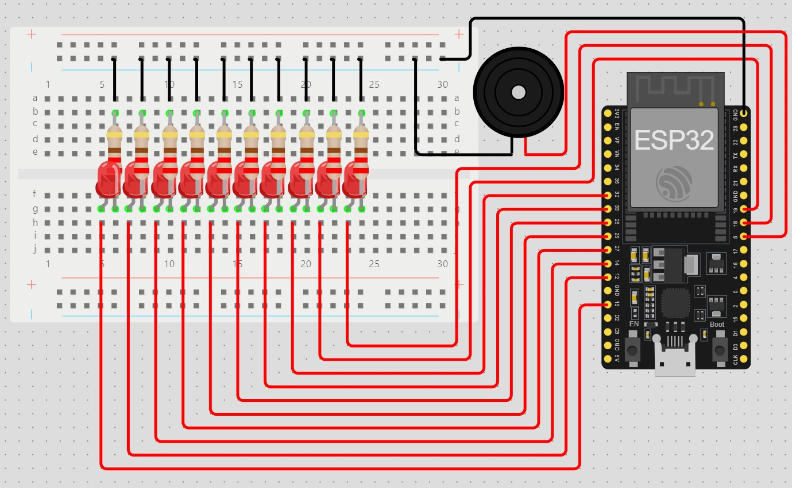

# ESP32 Alarm Clock with MQTT

A project for an alarm clock based on ESP32 that connects to an MQTT broker and, upon receiving an MQTT message, allows for remotely triggering LED animation and playing a rising sound on the buzzer.

## Requirements

- ESP32
- 10 LEDs, 10 resistors (220-330Ω), active buzzer, prototyping board, set of wires
- Arduino IDE or PlatformIO
- Libraries: WiFi.h, PubSubClient.h, WiFiClientSecure.h

## Circuit view

## Configuration

### MQTT Broker

An MQTT broker is a server that facilitates communication between devices via the MQTT protocol. You can use popular public brokers like HiveMQ or Eclipse Mosquitto. Create a free account, set up a username and password, and verify the port on which the broker operates (usually 1883 for non-TLS MQTT or 8883 for secure connections). Also, configure your credentials in the form of `MQTT_USERNAME` and `MQTT_PASSWORD`, which you will later use in the project setup.

### Project

1. Copy the file `config_example.h` to `config.h`.
2. Fill in your details in the `config.h` file:
   - Wi-Fi network name (`WIFI_SSID`)
   - Wi-Fi password (`WIFI_PASSWORD`)
   - MQTT broker address (`MQTT_BROKER`)
   - MQTT login and password (`MQTT_USERNAME` and `MQTT_PASSWORD`)
   - MQTT topic you want to subscribe to (`MQTT_TOPIC`)
3. The `config.h` file is ignored in the repository, so you don't have to worry about exposing your sensitive data.

## Using the Project

1. Upload the code to ESP32 using Arduino IDE or PlatformIO.
2. Once ESP32 is running, it will connect to your Wi-Fi network and the MQTT broker.
3. Now, using another MQTT client (e.g., one written in any programming language), you can send MQTT messages to the device on the topic defined in `MQTT_TOPIC`:
   - The message `ON` will turn on the LEDs.
   - The message `OFF` will turn off the LEDs.

## Demonstration

You can watch a video demonstrating the functionality of the project [here](https://youtu.be/vKcXYqivB5o).

### Notes

In this example, `espClient.setInsecure()` is used to skip SSL certificate verification. In a production environment, it is recommended to load proper certificates to ensure secure communication with the MQTT broker.

## License

The project is available under the [MIT](./LICENSE) license.
