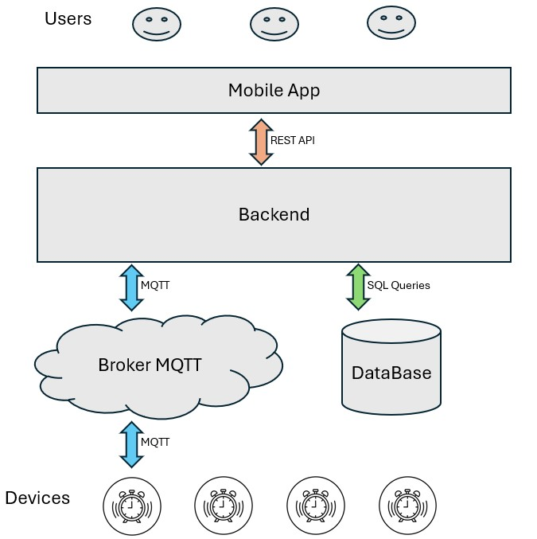

# IoT Management System

System do zarządzania DIY urządzeniami inteligentnego domu (IoT) stworzony na bazie urządzeń ESP32 z backendem w .NET i aplikacją mobilną we Flutterze. System pozwala na uruchamianie urządzeń pojedynczo lub grupowanie ich w automatyzacje których dni, oraz czas uruchamiania i dezaktywacji ustawia użytkownik poprzez aplikację mobilną. Zarządzanie oraz monitorowanie urządzeń obywa się za pomocą MQTT oraz REST API.

## Stack technologiczny

### Backend (.NET Core)

- **.NET Core**: 8
- **Entity Framework Core**: 8.0.6
- **AutoMapper**: 13.0.1
- **FluentValidation**: 11.3.0
- **JWT Bearer**: 8.0.6
- **NLog**: 5.3.14
- **MQTT (MQTTnet)**: 4.3.7

### Aplikacja mobilna (Flutter)

- **Flutter SDK**: 2.5.3
- **Dart**: 3.4.3

### Baza danych

- **SQL Server**: SQL Server 2019

### Broker MQTT

- Online - **HiveMQ.com**

### Urządzenia IoT

- **esp32-devkitc v1** - lub jakiekolwiek inne ESP32 (system działa również na arduino, lecz kod [firmware](./firmware) posiada funkcje działające jedynie na ESP)
- Arduino Core for ESP32: 1.0.6
- PubSubClient: 2.8
- WiFiClientSecure

## Architektura systemu

- **Aplikacja mobilna (Flutter)** – Interfejs użytkownika pozwalający na komunikację użytkownika z systemem.
- **Backend (.NET)** – Odpowiada za autoryzację użytkownika, przetwarzanie danych, oraz komunikację z online brokerem MQTT który jest łącznikiem między backendem a urządzeniami IoT.
- **Broker MQTT** – Odpowiada za przekazywanie wiaodmości między rdzeniem systemu - backendem, a końcowymi punktami - urządzeniami. Wiaodmości te zawierają polecenie o włączeniu/wyłączneiu urządzenia, lub parametry pobrane przez urządzenia takie jak zmierzona temperatura, czy obecność ruchu w pomieszczeniu.
- **Urządzenia IoT (ESP32)** – DIY urządzenia, takie jak budzik, które można konfigurować i kontrolować z poziomu aplikacji mobilnej.



## Dokumentacja API

Szczegółowa dokumentacja endpointów dostępna jest [tutaj](https://WojciechCholewinski.github.io/IoT-Management-System/).

## Wymagania

- **Backend**: .NET Core 8
- **Mobile**: Flutter SDK 2.5+
- **IoT Device**: ESP32 np użyte w projekcie: **ESP32-DevKit ESP-WROOM-32 WiFi + BT 4.2.**

## Instalacja i Konfiguracja

1. **Sklonuj repozytorium**:
   ```bash
   git clone https://github.com/yourusername/your-repo.git
   ```
2. **Backend**:

   - Przejdź do [instrukcji konfiguracji backendu](./backend/README.md) w folderze `backend`.
   - Skonfiguruj bazę danych SQL Server oraz ustawienia MQTT.

3. **Aplikacja mobilna**:

   - Przejdź do [instrukcji konfiguracji aplikacji mobilnej](./mobile/README.md) w folderze `mobile`.
   - Zainstaluj zależności Fluttera oraz skonfiguruj środowisko.

4. **Urządzenia IoT (ESP32)**:
   - Przejdź do [instrukcji konfiguracji urządzeń IoT](./firmware/alarm_clock/readme.md) w folderze `firmware/alarm_clock`.
   - Skonfiguruj dane połączenia MQTT i wgraj firmware na ESP32.

## Przykłady użycia

System pozwala na ustawienie alarmu w aplikacji mobilnej. Użytkownik może wybrać dzień oraz godzinę, o której urządzenie ESP32 (np. budzik) ma się uruchomić.

Przykład:

1. Użytkownik ustawia aplikacji mobilnej alarm na każdy poniedziałek i środę na godzinę 7:00.
2. Aplikacja wysyła informację do backendu, który zapisuje je w bazie danych oraz przekazuje je do brokera MQTT.
3. Broker mqtt przekazuje tę wiadomość na określony, ustawiony podczas konfiguracji temat.
4. ESP32 subskrybujące przeznaczony temat odbiera wiadomość od brokera o konieczności włączenia alarmu i aktywuje alarm o wyznaczonej godzinie.

## Licencja

Projekt jest dostępny na licencji [MIT](./firmware/alarm_clock/LICENSE). Więcej informacji znajdziesz w pliku LICENSE.
