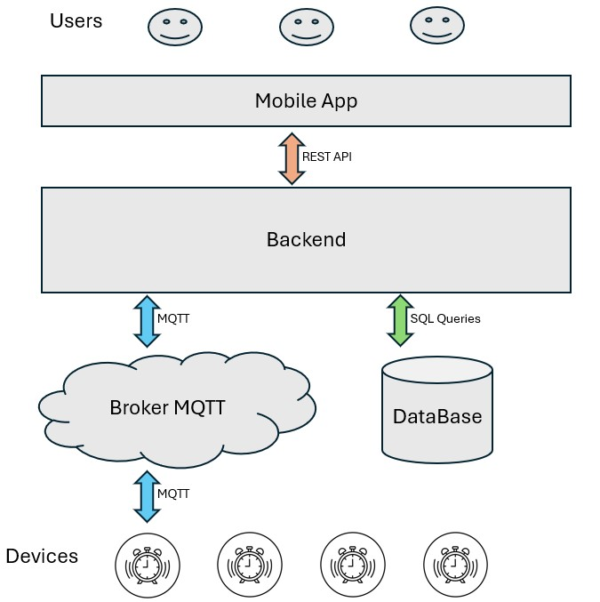

# IoT Management System


<!--


 -->

System do zarządzania DIY urządzeniami inteligentnego domu (IoT) stworzony na bazie urządzeń ESP32 z backendem w .NET i aplikacją mobilną we Flutterze. System pozwala na uruchamianie urządzeń pojedynczo lub grupowanie ich w automatyzacje których dni, oraz czas uruchamiania i dezaktywacji ustawia użytkownik poprzez aplikację mobilną. Zarządzanie oraz monitorowanie urządzeń obywa się za pomocą MQTT oraz REST API.

## Stack technologiczny

<!-- Stack technologiczny -->
<h3>
<details>
  <summary>Backend (.NET)</summary>
  <ul>
    <li><small><a href="https://dotnet.microsoft.com/en-us/download/dotnet/8.0">.NET</a> 8</small></li>
    <li><small><a href="https://learn.microsoft.com/en-us/ef/core/">Entity Framework Core:</a> 8.0.6</small></li>
    <li><small><a href="https://automapper.org/">AutoMapper:</a> 13.0.1</small></li>
    <li><small><a href="https://docs.fluentvalidation.net/en/latest/">FluentValidation:</a> 11.3.0</small></li>
    <li><small><a href="https://jwt.io/">JWT Bearer:</a> 8.0.6</small></li>
    <li><small><a href="https://nlog-project.org/">NLog:</a> 5.3.14</small></li>
    <li><small><a href="https://github.com/dotnet/MQTTnet/wiki">MQTTnet:</a> 4.3.7</small></li>
  </ul>
</details>
<h3>

<h3>
<details>
  <summary>Aplikacja mobilna (Flutter)</summary>
  <ul>
    <li><small><a href="https://docs.flutter.dev/">Flutter SDK:</a> 2.5.3</small></li>
    <li><small><a href="https://dart.dev/guides/">Dart:</a> 3.4.3</small></li>
  </ul>
</details> 
</h3>

<h3>
<details>
  <summary>Baza danych</summary>
  <ul>
    <li><small>SQL Server: <a href="https://www.microsoft.com/en-us/sql-server/">SQL Server 2019</a></small></li>
    <li><small>DBMS: <a href="https://learn.microsoft.com/en-us/sql/ssms/">SQL Server Management Studio 20</a></small></li>
    <li><small>ORM: <a href="https://learn.microsoft.com/en-us/ef/core/">Entity Framework Core</a></small></li>
  </ul>
</details>
</h3>

<h3>
<details>
  <summary>Urządzenia IoT</summary>
  <ul>
    <li><small>Mikrokontroler: <a href="https://botland.com.pl/moduly-wifi-i-bt-esp32/8893-esp32-wifi-bt-42-platforma-z-modulem-esp-wroom-32-zgodny-z-esp32-devkit-5904422337438.html">ESP32-DevKit ESP-WROOM-32 WiFi+BT 4.2</a></small></li>
    <li><small>IDE: <a href="https://github.com/espressif/arduino-esp32">Arduino Core for ESP32:</a> 1.0.6</small></li>
    <li>
        <small>
            Libraries:
            <ul>
                <li>PubSubClient 2.8</li>
                <li>WiFiClientSecure</li>
            </ul>
      </small>
    </li>
  </ul>
</details>
</h3>

## Architektura systemu

- **Aplikacja mobilna (Flutter)** – Interfejs użytkownika pozwalający na komunikację użytkownika z systemem.
- **Backend (.NET)** – Odpowiada za autoryzację użytkownika, przetwarzanie danych, oraz komunikację z online brokerem MQTT który jest łącznikiem między backendem a urządzeniami IoT.
- **Broker MQTT** – Odpowiada za przekazywanie wiaodmości między rdzeniem systemu - backendem, a końcowymi punktami - urządzeniami. Wiaodmości te zawierają polecenie o włączeniu/wyłączneiu urządzenia, lub parametry pobrane przez urządzenia takie jak zmierzona temperatura, czy obecność ruchu w pomieszczeniu.
- **Urządzenia IoT (ESP32)** – DIY urządzenia, takie jak budzik, które można konfigurować i kontrolować z poziomu aplikacji mobilnej.



## Dokumentacja API

Dokumentacja endpointów dostępna jest tutaj -> [swagger](https://WojciechCholewinski.github.io/IoT-Management-System/).

## Wymagania

- **Backend**: .NET 8
- **Mobile**: Flutter SDK 2.5+
- **IoT Device**: ESP32 np użyte w projekcie: **ESP32-DevKit ESP-WROOM-32 WiFi + BT 4.2.** lub jakiekolwiek inne ESP32 (system działa również na arduino, lecz kod [firmware](./firmware) posiada funkcje działające jedynie na ESP).

## Instalacja i Konfiguracja

1. **Sklonuj repozytorium**:
   ```bash
   git clone https://github.com/yourusername/your-repo.git
   ```
2. **Backend**:

   - Przejdź do [instrukcji konfiguracji backendu](./backend/README.md) w folderze `backend`.
   - Skonfiguruj bazę danych SQL Server oraz ustawienia MQTT.

3. **Aplikacja mobilna**:

   - Przejdź do [instrukcji konfiguracji aplikacji mobilnej](./mobile/README.md) w folderze `mobile`.
   - Zainstaluj zależności Fluttera oraz skonfiguruj środowisko.

4. **Urządzenia IoT (ESP32)**:
   - Przejdź do [instrukcji konfiguracji urządzeń IoT](./firmware/alarm_clock/readme.md) w folderze `firmware/alarm_clock`.
   - Skonfiguruj dane połączenia MQTT i wgraj firmware na ESP32.

## Przykłady użycia

System pozwala na ustawienie automatyzacji łączącej kilka urządzeń w aplikacji mobilnej.
Użytkownik może wybrać dzień oraz godzinę, o której urządzenia mają się uruchomić.

Przykład:

1. Użytkownik ustawia w aplikacji mobilnej budzik, podnoszenie rolet, oraz uruchomienie klimatyzacji na każdy poniedziałek i środę na godzinę 7:00.
2. Aplikacja wysyła ustawienia do backendu, który zapisuje je w bazie danych oraz czeka na ustawioną godzinę.
3. O ustawionej przez użytkownika godzinie, backend przekazuje wiadomość o konieczności włączenia urządzenia do bazy i do brokera MQTT.
4. Broker mqtt przekazuje tę wiadomość na określony, ustawiony podczas konfiguracji temat.
5. ESP32 subskrybujące przeznaczony temat odbiera wiadomość od brokera o konieczności włączenia urządzeń i je aktywuje.

## Licencja

Projekt jest dostępny na licencji [MIT](./firmware/alarm_clock/LICENSE).
